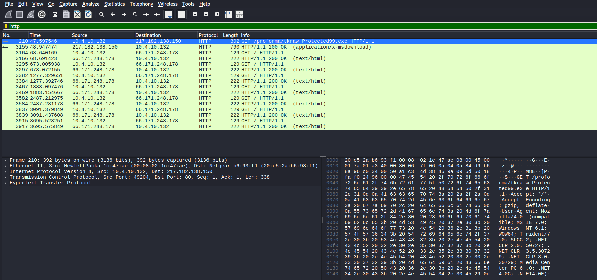
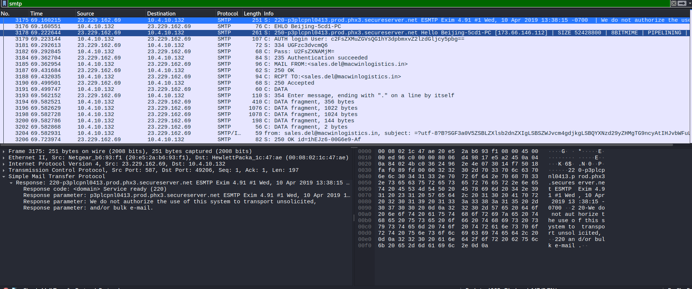
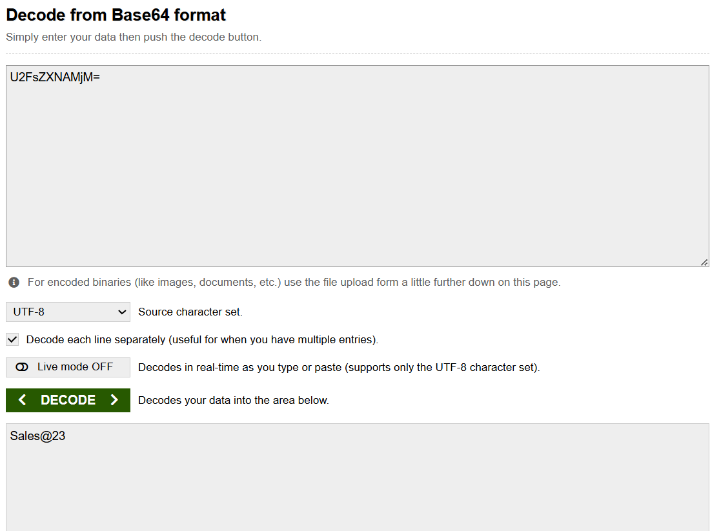
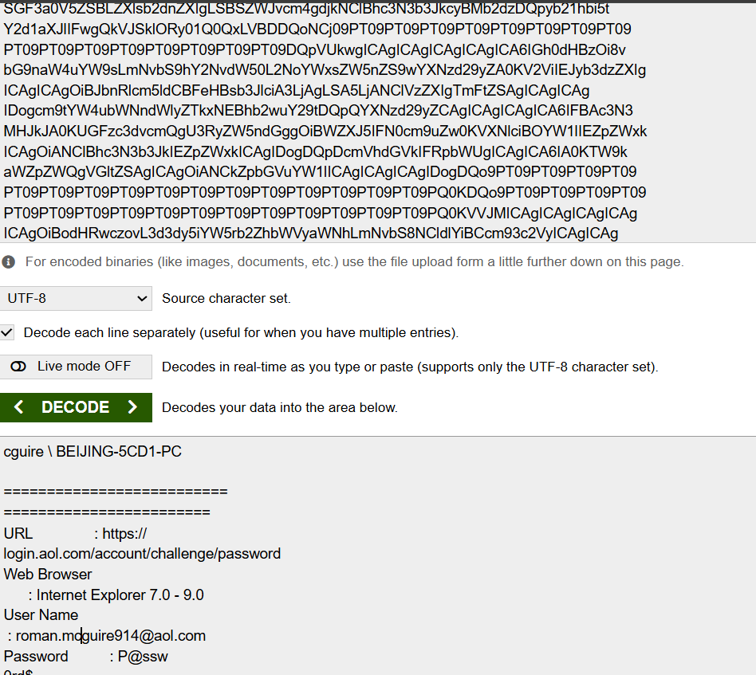
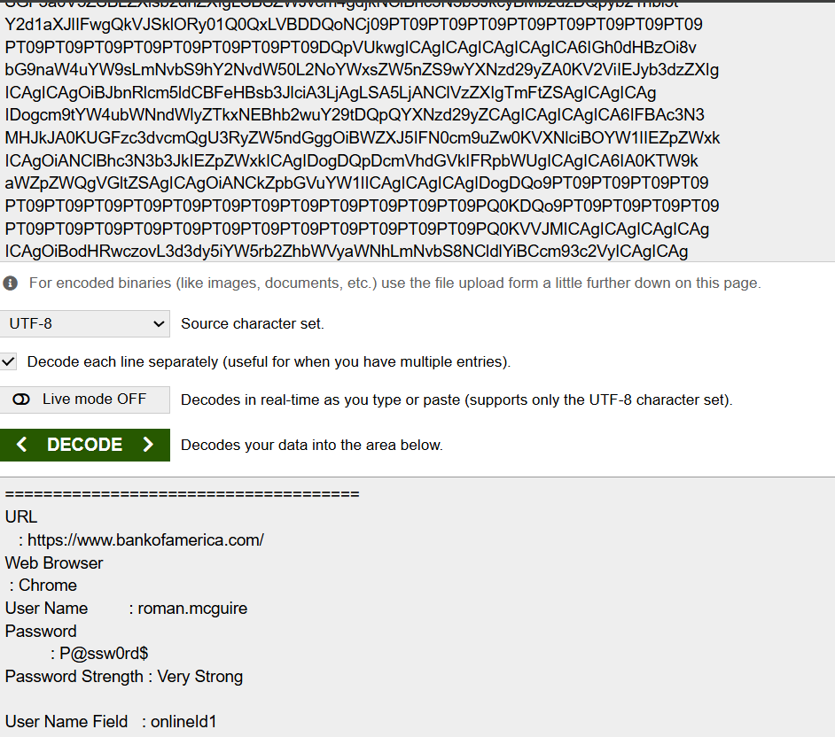
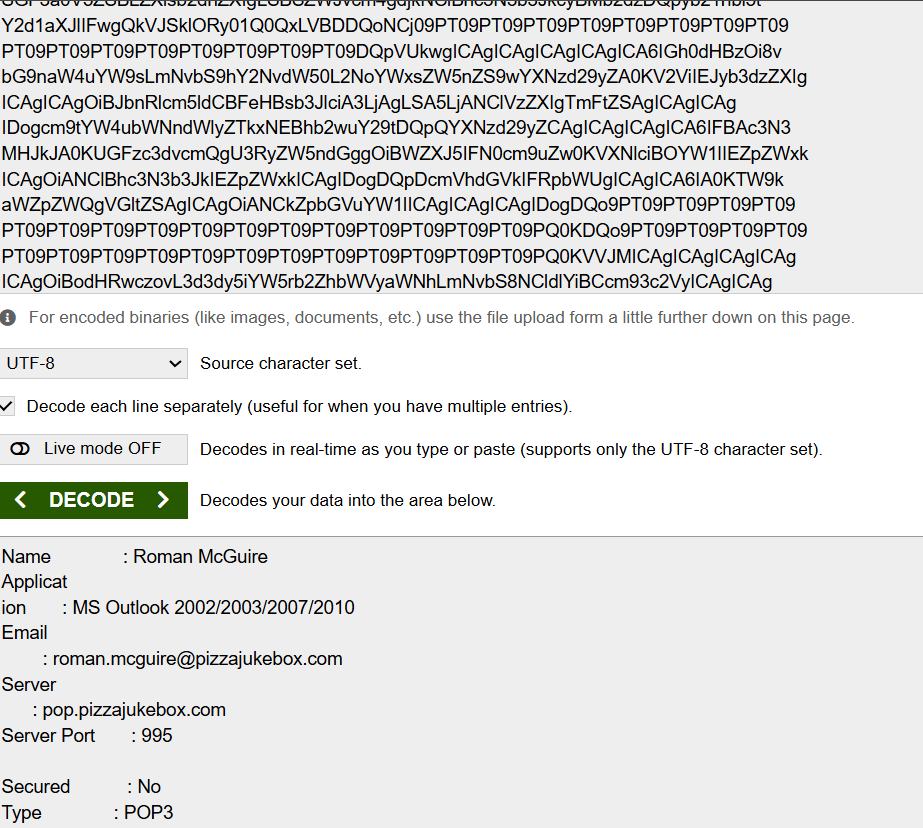

# Hawkeye Blue Team

## **BLUE TEAM REPORT**

## Executive Summary

On April 10, 2019, a workstation identified as BEIJING-5CD1-PC (10.4.10.132) was compromised by HawkEye Keylogger - Reborn v9,a credential harvesting malware. The infected machine downloaded a malicious executable(tkraw_Protected99.exe) from an external server hosted in France (217.182.138.150). The malware silently captured stored credentials from the victim's web browsers and email client, then exfiltrated them via SMTP to an attacker controlled email address every 10 minutes. Stolen credentials included access to Bank of America, AOL, and MS Outlook accounts belonging to user roman.mcguire.

## Scope and Methodology

Scope:
This investigation involved forensic analysis of a single packet capture file (stealer.pcap) containing 4,003 packets spanning a 01:03:41 timeframe recorded on April 10, 2019.

Tools Used:

- Wireshark — network traffic analysis and packet inspection
- VirusTotal — malware identification via MD5 hash lookup
- [Base64Decode.org](http://base64decode.org/) — decoding of base64 encoded credentials and email subject lines

Methodology:
Network traffic was analyzed using protocol specific filters (HTTP, SMTP, DNS) to identify malicious activity. HTTP traffic was examined to identify malware delivery. SMTP traffic was followed using TCP stream analysis to extract exfiltrated data. Identified artifacts were cross referenced against threat intelligence platforms for malware classification.

## **Findings**

#### Finding-1

Malicious File Download via HTTP
Severity: High

Source IP:    10.4.10.132 (victim workstation)
Destination:  217.182.138.150 (malware server)
Domain:       [proforma-invoices.com](http://proforma-invoices.com/)
File:         tkraw_Protected99.exe
MD5 Hash:     71826ba081e303866ce2a2534491a2f7
Protocol:     HTTP GET Request
Response:     200 OK (successful download)
File Type:    Windows Executable (.exe)
Hosted In:    France

What Happened:
The victim workstation made an outbound HTTP request to [proforma-invoices.com](http://proforma-invoices.com/) hosted on 217.182.138.150 (France) and successfully downloaded a malicious Windows executable. This represents the malware delivery stage of the attack chain.

#### Finding-2

Credential Exfiltration via SMTP
Severity: Critical

Victim Machine:  10.4.10.132
Hostname:        BEIJING-5CD1-PC
Public IP:       173.66.146.112
SMTP Server:     23.229.162.69 (United States)
Email Account:   [sales.del@macwinlogistics.in](mailto:sales.del@macwinlogistics.in)
Password:        U2FsZXNAMjM= (base64)
Decoded:         sales@23

Exfil Interval:  Every 10 minutes

Credentials Stolen:

- Bank of America: roman.mcguire / P@ssw0rd$
- AOL: [roman.mcguire914@aol.com](mailto:roman.mcguire914@aol.com) / P@ssw0rd$
- MS Outlook: [roman.mcguire@pizzajukebox.com](mailto:roman.mcguire@pizzajukebox.com)

What Happened:
HawkEye Keylogger - Reborn v9 harvested stored credentials from the victim's browsers and email
client, then exfiltrated them to an attacker controlled email address every 10 minutes via SMTP. Credentials were transmitted with only base64 encoding — providing zero real protection.

Impact:
Full compromise of banking, personal email, and corporate email accounts belonging to roman.mcguire.

## **Attack Timeline**

20:37:00  →  Investigation begins. Victim workstation (BEIJING-5CD1-PC) connects to domain controller via Kerberos (port 88)

20:37:46  →  Victim workstation queries DNS for [proforma-invoices.com](http://proforma-invoices.com/) (packet 204)
Resolves to 217.182.138.150 (France)

20:37:47  →  Victim workstation downloads tkraw_Protected99.exe from [proforma-invoices.com](http://proforma-invoices.com/) via HTTP GET
MD5: 71826ba081e303866ce2a2534491a2f7

20:38:08  →  HawkEye Reborn v9 establishes SMTP connection to 23.229.162.69 (United States)
Authenticates using [sales.del@macwinlogistics.in](mailto:sales.del@macwinlogistics.in)

20:38:08  →  First credential exfiltration occurs. Stolen data includes Bank of America, AOL, and MS Outlook credentials belonging to roman.mcguire

20:38:08  →  Malware begins exfiltrating data every 10 minutes via SMTP

21:40:41  →  Last packet captured. Exfiltration ongoing at time of capture.

## Indicators of Compromise (IOCs)

IP Addresses:
10.4.10.132     →  Victim workstation (internal)
217.182.138.150 →  Malware hosting server (France)
23.229.162.69   →  SMTP exfiltration server (USA)
66.171.248.178  →  C2 beacon destination
173.66.146.112  →  Victim public IP

Domains:
[proforma-invoices.com](http://proforma-invoices.com/)  →  Malware delivery domain

Files:
Filename:  tkraw_Protected99.exe
MD5:       71826ba081e303866ce2a2534491a2f7
Type:      Windows Executable
Source:    [proforma-invoices.com/proforma/](http://proforma-invoices.com/proforma/)

Credentials Compromised:
[sales.del@macwinlogistics.in](mailto:sales.del@macwinlogistics.in)  →  sales@23
roman.mcguire (BofA)          →  P@ssw0rd$
[roman.mcguire914@aol.com](mailto:roman.mcguire914@aol.com)      →  P@ssw0rd$
roman.mcguire@pizzajukebox.com→  P@ssw0rd$

Email:
Exfil address: [sales.del@macwinlogistics.in](mailto:sales.del@macwinlogistics.in)
SMTP server:   [p3plcpnl0413.prod.phx3.secureserver.net](http://p3plcpnl0413.prod.phx3.secureserver.net/)
Interval:      Every 10 minutes

## Recommendations

1. Block Malicious IPs and Domains Immediately block at firewall level:
    - 217.182.138.150
    - 23.229.162.69
    - 66.171.248.178
    - [proforma-invoices.com](http://proforma-invoices.com/)
2. Isolate and Reimage Victim Machine BEIJING-5CD1-PC (10.4.10.132) is fully compromised. Isolate immediately and reimage from clean backup.
3. Reset All Compromised Credentials Immediately reset passwords for:
    - [sales.del@macwinlogistics.in](mailto:sales.del@macwinlogistics.in)
    - roman.mcguire Bank of America account
    - [roman.mcguire914@aol.com](mailto:roman.mcguire914@aol.com)
    - [roman.mcguire@pizzajukebox.com](mailto:roman.mcguire@pizzajukebox.com) Enable MFA on all accounts.
4. Block Executable Downloads via HTTP Configure web proxy to block .exe downloads over unencrypted HTTP. All software installation should go through approved channels only.
5. Deploy Email Security Controls Implement SMTP monitoring to detect unusual outbound email patterns. Alert on authentication attempts using base64 encoded credentials.
6. Security Awareness Training User roman.mcguire downloaded amalicious executable. Conduct
phishing awareness training for all staff immediately.
7. Endpoint Detection Deploy EDR solution to detect keylogger behavior and unauthorized credential access on endpoints.

## Conclusions

This investigation confirms a successful HawkEye Keylogger - Reborn v9 infection on workstation BEIJING-5CD1-PC (10.4.10.132). The attack followed a clear chain — malwaredelivery via HTTP, silent credential harvesting, and automated exfiltration via SMTP every 10 minutes.

The malware successfully compromised four accounts belonging to user roman.mcguire including banking, personal, and corporate email credentials. At the time of capture, exfiltration was still ongoing indicating the threat was active.

The organization's lack of outbound traffic monitoring, endpoint protection, and email security controls allowed this attack to operate undetected for the full duration of the capture (01:03:41).

Immediate actions required: isolate the victim machine, reset all compromised credentials, block identified IOCs, and implement the security controls outlined in the recommendations section.