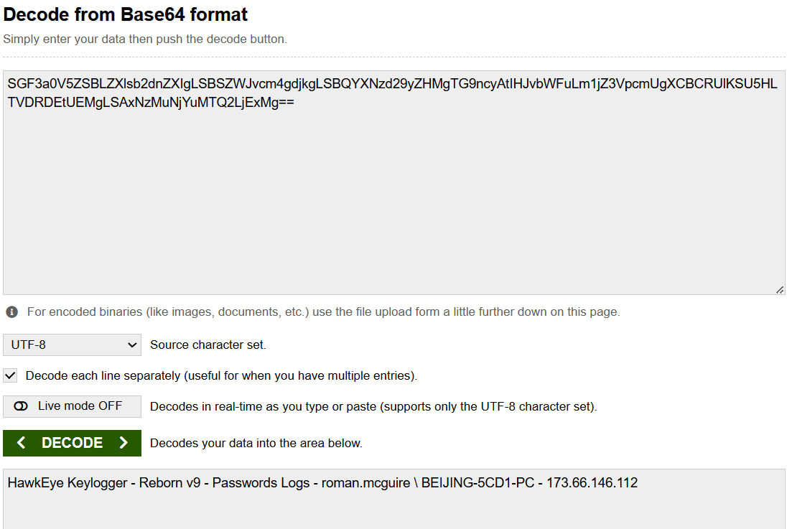

# Hawkeye Red Team

## **RED TEAM REPORT**

## **Executive Summary**

A targeted attack was successfully executed against workstation BEIJING-5CD1-PC (10.4.10.132) using HawkEye Keylogger - Reborn v9. The attack achieved full credential harvesting from the target's browsers and email client without detection. Exfiltration was conducted via SMTP to an attacker controlled email address at 10 minute intervals. The operation successfully obtained banking credentials (Bank of America), personal email (AOL), and corporate email (MS Outlook) belonging to user roman.mcguire. The target showed no signs of detection throughout the operation.

## **Scope & Methodology**

Scope:
Target: Windows workstation BEIJING-5CD1-PC
IP: 10.4.10.132
User: roman.mcguire
Objective: Credential harvesting and exfiltration

Tools Used:

- HawkEye Keylogger - Reborn v9
Delivered as tkraw_Protected99.exe
Hosted on [proforma-invoices.com](http://proforma-invoices.com/) (217.182.138.150)
- SMTP protocol for data exfiltration
Server: 23.229.162.69 (United States)

Methodology:
The operation followed a four phase approach:

Phase 1 — Delivery
Malicious payload hosted on attacker controlled domain [proforma-invoices.com](http://proforma-invoices.com/). Target was directed to download tkraw_Protected99.exe via HTTP.

Phase 2 — Execution
Payload executed on target workstation, establishing persistent credential monitoring silently in the background.

Phase 3 — Harvesting
HawkEye captured stored credentials from Chrome browser and MS Outlook email client belonging to user roman.mcguire.

Phase 4 — Exfiltration
Harvested credentials automatically exfiltrated via SMTP to attacker controlled email address every 10 minutes.

## **Attack Chain**

- PHASE-1 Initial Access

20:37:00 → the target workstation (BEIJING-5CD1-PC) (10.4.10.132 ) user roman.mcguire connects to domain controller via Kerberos (port 88)

20:37:46 → Target queries DNS for [proforma-invoices.com](http://proforma-invoices.com/) , resolves to 217.182.138.150 (France)

20:37:47 → Malicious payload tkraw_Protected99.exe successfully delivered to target via HTTP GET request
MD5: 71826ba081e303866ce2a2534491a2f7 

- PHASE-2  Execution

20:37:47  →  tkraw_Protected99.exe executes on target workstation silently
in the background

          HawkEye Reborn v9 initiates:
          - Browser credential scanning (Chrome, Internet Explorer)
          - Email client monitoring (MS Outlook)
          - Keylogging activity begins
          - No visible indication to user
          - Target remains unaware

- PHASE-3  Harvesting

After execution, HawkEye silently extracted stored credentials from:

Browser (Chrome):

- Bank of America: roman.mcguire / P@ssw0rd$
- AOL: [roman.mcguire914@aol.com](mailto:roman.mcguire914@aol.com) / P@ssw0rd$

Email Client (MS Outlook):

- [roman.mcguire@pizzajukebox.com](mailto:roman.mcguire@pizzajukebox.com) / P@ssw0rd$
- SMTP: [smtp.pizzajukebox.com](http://smtp.pizzajukebox.com/) port 587

All credentials harvested without any alert or notification to the user.

- PHASE-4 Exfiltration

Harvested credentials automatically exfiltrated via SMTP to attacker controlled email address every 10 minutes. 

20:38:08 → HawkEye establishes SMTP connection to attacker controlled server 23.229.162.69 (United States) Authenticates using: [sales.del@macwinlogistics.in](mailto:sales.del@macwinlogistics.in) / sales@23

20:38:08  →  First exfiltration successful.
Credentials transmitted:
- Bank of America: roman.mcguire / P@ssw0rd$
- AOL: [roman.mcguire914@aol.com](mailto:roman.mcguire914@aol.com) / P@ssw0rd$
- MS Outlook: [roman.mcguire@pizzajukebox.com](mailto:roman.mcguire@pizzajukebox.com)

20:38:08  →  Automated exfiltration begins every 10 minutes via SMTP . Data encoded in base64 in transit

21:40:41  →  Last packet captured . Exfiltration still active . Operation ongoing and undetected

## **MITRE ATT&CK Framework Mapping**

T1566 — Phishing
Initial delivery of malicious payload via social engineering

T1059 — Command and Scripting Interpreter
HawkEye executed via Windows scripting

T1555 — Credentials from Password Stores
Harvested credentials from Chrome and MS Outlook stored passwords

T1056 — Input Capture (Keylogging)
HawkEye Reborn v9 keylogger functionality captured user input silently

T1048 — Exfiltration Over Alternative Protocol
Data exfiltrated via SMTP rather than standard C2 channel

T1041 — Exfiltration Over C2 Channel
Repeated automated exfiltration every 10 minutes to attacker controlled email

T1071 — Application Layer Protocol
SMTP used as exfiltration channel to blend with normal email traffic

## **Indicators of Compromise**

IP Addresses:
10.4.10.132     →  Victim workstation (internal)
217.182.138.150 →  Malware hosting server (France)
23.229.162.69   →  SMTP exfiltration server (USA)
66.171.248.178  →  C2 beacon destination
173.66.146.112  →  Victim public IP

Domains:
[proforma-invoices.com](http://proforma-invoices.com/)  →  Malware delivery domain

Files:
Filename:  tkraw_Protected99.exe
MD5:       71826ba081e303866ce2a2534491a2f7
Type:      Windows Executable

Credentials Compromised:
[sales.del@macwinlogistics.in](mailto:sales.del@macwinlogistics.in)  →  sales@23
roman.mcguire (BofA)          →  P@ssw0rd$
[roman.mcguire914@aol.com](mailto:roman.mcguire914@aol.com)      →  P@ssw0rd$
[roman.mcguire@pizzajukebox.com](mailto:roman.mcguire@pizzajukebox.com) →  P@ssw0rd$

## **Conclusion**

This operation is a successful HawkEye Keylogger - Reborn v9 infection on target workstation BEIJING-5CD1-PC (10.4.10.132). The operation followed a clear chain — malware delivery via HTTP, silent credential harvesting, and automated exfiltration via SMTP every 10 minutes.

Hawkeye successfully compromised four accounts belonging to user roman.mcguire including banking, personal, and corporate email credentials. At the time of capture, exfiltration was still ongoing indicating persistent access was maintained throughout the operation.